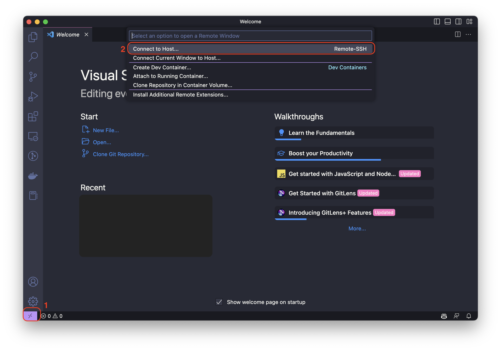

# 在非登陆节点上使用VSCode

VSCode 通过 Remote 插件提供了强大的远程编辑能力，使得用户可以在远程获得接近本地的编辑体验。
VSCode Server原生基于Node和Electron技术，有着较高的内存等需求，
但鉴于目前登陆节点的资源日渐捉襟见肘，这里提出一个方案，
可以让用户较为方便地使用非登陆节点的资源开启VSCode Remote。

本文假设用户已经阅读过[SSH 与 SCP 使用入门](ssh_note.md)特别是有关 `config` 文件的部分，
并知晓[集群的基础概况和调度系统使用方法](cluster_usage.md)。
如未阅读，请先参阅上述两篇文字。

## 使用 SCOW 提供的交互终端

## 原生 VS Code

诚然 code-server 可以提供良好体验，奈何在没有联网的集群上安装插件较为困难，故这里给出另一种方式，即利用原生的 Remote 功能来实现远程。

### MacOS 和 Linux 用户

由于笔者目前使用的设备是 MacOS 操作系统（Linux情况类似），这里给出较完整的图文说明。

首先用自己最顺手的方式打开并编辑 `~/.ssh/config` 文件，
请参照 [这里的说明](./ssh_note.md#ssh-config)，
增加登陆节点的配置信息:

``` title=".ssh/config"
Host <nickname>
    HostName <ip_of_zeus>
    Port <port>
    User <username>
```

请将`<ip_of_zeus>, <port>, <username>`替换为实际的IP地址、端口号以及用户名。
`<nickname>`请替换为任意自己喜欢的昵称，但请注意，
**不要使用`c5*`的形式！** 否则会和下文冲突。

然后增加以下几行：

``` title=".ssh/config"
Host c5*
    User <username>
    ProxyCommand ssh -o ForwardAgent=yes <username>@<nickname> "nc -w 120 %h %p"
```

这里采用 `c5*` 作为前缀是为了在登陆节点上快速登陆到对应的计算节点。
Zeus 集群上所有计算节点（含CPU、GPU、胖节点）均以 `c5*` 开头，具有类似 `c5*-*` 的形式，
故这里采用如此写法。请根据集群的情况对应调整。

然后在集群上，运行以下命令，开启一个虚拟终端：

```bash
user@login01$ bsub -q fat -n 1 -Is bash
Job <xxx> is submitted to queue <fat>.
<<Waiting for dispatch ...>>
<<Starting on c51-s001>>
user@c51-s001:~$ 
```

注意 `bsub` 的附加命令请参照[集群使用说明](cluster_usage.md)，
Walltime及队列情况仍需要参照设置。

然后，请打开一个VSCode窗口，并点击左下角的按钮，选择“Connect to Host”：



输入虚拟终端所在的节点，例如上文中的输出 `c51-s001`:


如果提示输入密码等信息，请按回车以继续


等待安装 VSCode Server 即可。若以前曾配置过远程，会自动调用之前的服务。

### Windows 用户

对于Windows用户，由于笔者暂时没有Windows设备，请参照[此教程](https://hpc.nih.gov/apps/vscode.html)尝试，思路比较接近。本文即参考了该文章的实现。
