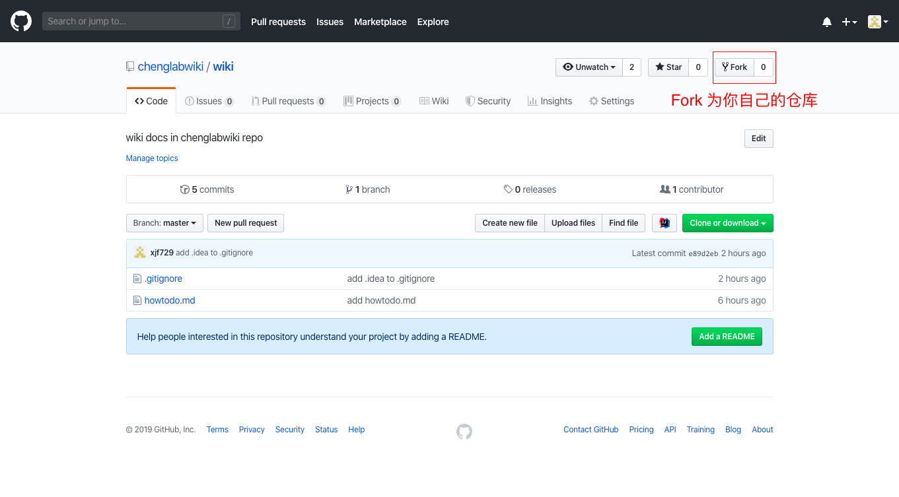
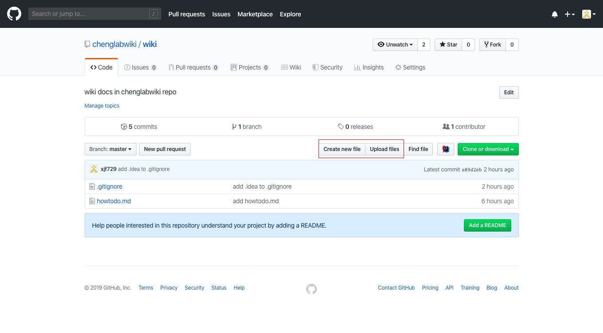
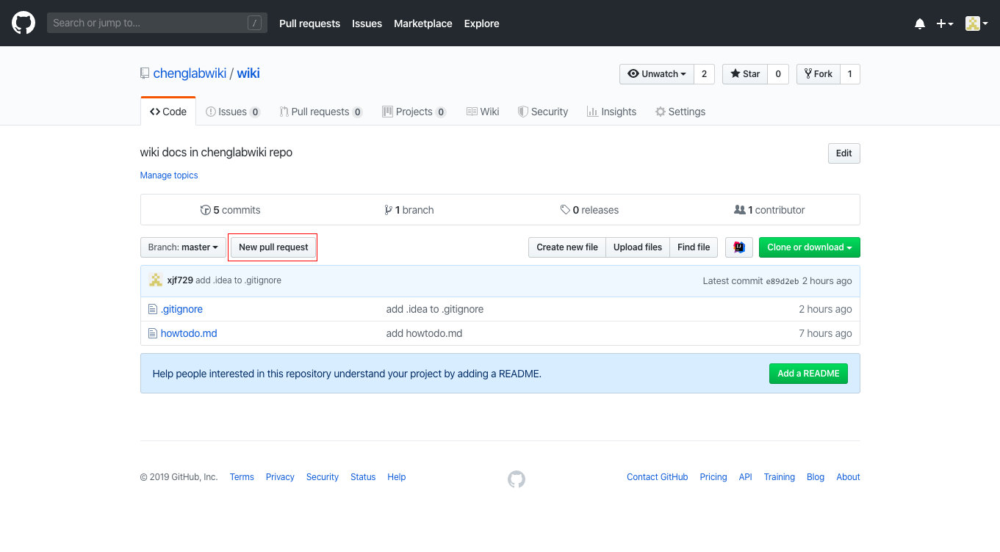
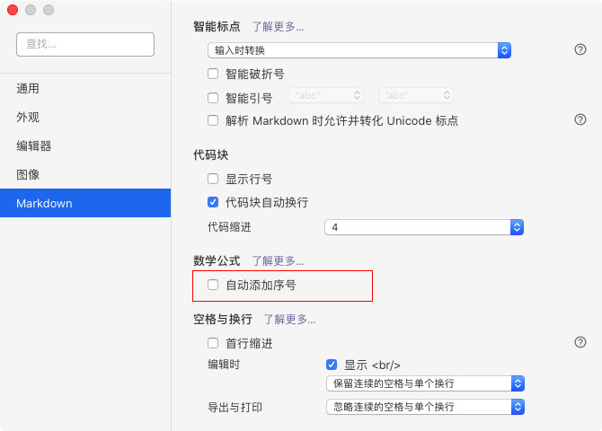

# 如何使用 Wiki

Wiki 书写使用 markdown 格式。本 wiki 使用 python-markdown 作为 markdown 的解释器，支持一些 markdown 的扩展语法。在本地编辑 markdown 文件时，推荐使用 [VSCode](https://code.visualstudio.com) 或者 [Obsidian](https://obsidian.md/)。

!!! warning
    Typora正式版已经收费，且测试版在某些系统环境已不可用。

有任何问题可以在 <{{ config.repo_url }}/issues> 进行反馈。

> 文档中带有 `*` 的部分可以略过。


## 对某篇 wiki 内容有疑问

请使用页面下方的评论区、登陆Github账号后进行评论。该部分基于[giscus](https://giscus.app/)构建，可以自动创建一个discussion，从而提供方便的互动。此功能需要创建页面的贡献者手动开启。

## 如何上传 wiki

如果还不会 markdown 语法，可以先看 [markdown 语法部分](#markdown-grammar)，能被识别为 wiki 的 markdown 文件应在文件的开头插入 [YAML Front Matter](#yaml-front-matter)。把自己的 markdown 文档上传到 wiki 上可以有两种方案，本质都是在使用 Github: 1. 上传文件至 Github 仓库 (推荐)；2. 由 [wiki 网站](../../index.md) 导向编辑页面。

### 上传文件至 github 仓库 (推荐)

推荐通过 pull requests 的方法来增加或修改 [wiki 网站](../../index.md) 上的 wiki。

#### 1. Fork wiki 文档所在仓库 { #1-fork-wiki-repo }

先 fork <{{ config.repo_url }}> ，然后进入 fork 成功后的仓库。



#### 2. 创建新文件或上传本地文件



推荐在本地用 typora 等编辑器写好 markdown 后直接上传文件，文件请上传至 [_wiki]({{ config.repo_url }}/tree/master/docs/wiki) 目录 (master 分支)。也可以修改 fork 的仓库的 `docs/wiki` 下的文件，然后再提交 PR。

#### 3. 设置导航

在上传新的文档后，需要手动在仓库首级的 `mkdocs.yml` 中设置导航。

例如在软件使用中增加 VASP 使用教程的话（假设放在 `docs/wiki/software_usage/vasp.md`），且希望放在 CP2K 和 DP-GEN 之间，请在 `nav` 中增加如下内容：

```yaml
nav:
  ...
  - Wikis:
      ...
      - 软件使用:
          ...
          - wiki/software_usage/Tips_for_LaTeX.md
          - CP2K:
              ...
          - wiki/software_usage/vasp.md # 新增导航
          - wiki/software_usage/DP-GEN.md
          ...
      ...
```

#### 4. 提交 PR



## 如何预览 wiki

预览 wiki 也有多种方案:
1. 利用 VSCode 或 Obsidian 进行预览（推荐）
2. 在本地启动 Mkdocs 服务
3. 使用 typora 等实时渲染

这里我们对后两种方式进行介绍

### 通过 Mkdocs 服务*

#### 1. 下载网站源码至本地

```bash
git clone {{ config.repo_url }}.git
cd chenggroup.github.io
```

#### 2. 安装 [mkdocs-material](https://squidfunk.github.io/mkdocs-material/getting-started/) 和 必要的 mkdocs 插件

可参考 [mkdocs-material 官方安装指南](https://squidfunk.github.io/mkdocs-material/getting-started/)

```bash
pip install mkdocs-material \
    mkdocs-macros-plugin \
    mkdocs-static-i18n[material]
```
为了获得完美的渲染效果，可能需要额外安装某些插件。

```bash
pip install mkdocs-git-revision-date-localized-plugin \
    mkdocs-material-extensions
```

#### 4. 启动 Mkdocs 服务

```bash
mkdocs serve
```

#### 5. 编辑 wiki

把要预览的 wiki 移到 `docs/wiki/` 目录下，或是直接编辑 `docs/wiki/` 目录下的 markdown 文件。

#### 6. 预览 wiki

等待片刻，打开浏览器访问 <http://127.0.0.1:8000> ，即可进行实时预览。

### 通过 typora (注意已经收费)

使用 [typora](https://www.typora.io/ "轻量化md编辑工具") 编辑器可以很方便地实时渲染 markdown 文件。如果不使用本 wiki 中标注有 `*` 的 [wiki 扩展语法](#button) ，则可以大体上认为 typora 所渲染出的文档与直接查看 [wiki 网站](../../index.md) 的文档相差无几，基本仅存在显示风格上的差异。但要注意需更改 typora 的一些设置（见后文），避免和 wiki 所使用的 markdown 扩展功能发生冲突。

#### 修改 markdown 拓展语法设置

需要关闭上下标、高亮以及图表的功能。


#### 修改数学公式设置

需要关闭数学公式自动添加序号的功能。



#### 插入图片

请把图片统一放在 `docs/images/` 下，以确保无论何时这些图片都可用。

## Markdown 语法 { #markdown-grammar }

Markdown 是一种标记语言，和代码一样，可以用纯文本的形式来书写。其使用的常用标记符号不超过十个，可以让人专注于文字而不是排版，并且也可以方便地导出为 HTML、PDF 等格式。

### 基本语法


!!! warning "注意"
    插入图片时切勿使用本地路径，否则在 wiki 上无法查看。

可参考 [markdown 教程](https://www.markdownguide.org/basic-syntax/) 与 [练习](https://www.markdowntutorial.com/) 来学习基本语法。

!!! warning "注意"
    要引用同一篇 wiki 中的小标题（二至六级标题）可以通过 `[sub title](#sub-title)` 来引用。不过需要注意，要把小标题中的空格用 `-` 代替，所有大写字母改成小写，且忽略 `.` , `&` 等特殊符号。
    
    请注意，如被引用的链接中包含中文，Mkdocs 不能提供良好支持。请通过添加别名的方式来实现，比如要链接到[1. Fork wiki 文档所在仓库](#1-fork-wiki-repo)，请在 `#### 1. Fork wiki 文档所在仓库` 后添加 `{ #1-fork-wiki-repo }`:

    ```
      #### 1. Fork wiki 文档所在仓库 { #1-fork-wiki-repo }
    ```

    在引用时，请使用别名进行链接 `[1. Fork wiki 文档所在仓库](#1-fork-wiki-repo)`。

### GFM 扩展语法

GFM(GitHub Flavored Markdown) 是 GitHub 所使用的 Markdown 扩展语法。

#### 清单

```gfm
- [ ] 未完成列表
- [x] 已完成列表
```

- [ ] 未完成列表
- [x] 已完成列表

#### 表情

```gfm
:eyeglasses: :+1:
```

:eyeglasses: :+1:

### Wiki 扩展语法

标注 * 的部分可以不去注意

#### YAML Front Matter

##### 加入标题

只有在 `markdown` 文件的头部加入 `YAML Front Matter` 部分，才能使你写的 wiki 展示在网页上。因此最简单的，请在 `YAML Front Matter` 中加入 `title`，如下所示：

```yaml
---
title: getting-started
---
```

##### 添加作者

在 `YAML Front Matter` 中加入 `authors` 即可添加作者，多个作者用 yaml 语法的列表表示：

```yaml
---
title: getting-started
authors: one author
---
```

```yaml
---
title: getting-started
authors:
  - author1
  - author2
---
```

##### 开启评论功能

对创建页面的编辑者来说，通常情况下请开启评论功能、以便读者可以快速提交反馈或评论，即在 `YAML Front Matter` 部分增加一行：

```yaml
---
...
comments: true
---
```

#### 数学公式

数学公式可以用 LaTeX 语法来书写，两端用 `$`(一般用于行内公式) 或 `$$`(会使公式居中显示) 来标记，如 `$E=mc^2$` 可表示 $E=mc^2$ 。

```gfm
$$
E[\rho] = T_s[\rho] + \int \mathrm{d}r\ v_{\rm ext}(r)\rho(r) + V_{H}[\rho] + E_{\rm xc}[\rho]
$$
```

$$
E[\rho] = T_s[\rho] + \int \mathrm{d}r\ v_{\rm ext}(r)\rho(r) + V_{H}[\rho] + E_{\rm xc}[\rho]
$$

要表示多行公式，需要使用 `aligned`，并要在行尾部加 `\\`。

```gfm
$$
\begin{aligned} \dot{x} &= \sigma(y-x) \\
\dot{y} &= \rho x - y - xz \\
\dot{z} &= -\beta z + xy \end{aligned} 
$$
```

$$
\begin{aligned} \dot{x} &= \sigma(y-x) \\
\dot{y} &= \rho x - y - xz \\
\dot{z} &= -\beta z + xy \end{aligned}
$$

若实现给公式编号等功能，可参照 LaTeX 的做法。

#### 化学式与化学反应式

此功能通过 LaTeX 的 mhchem 插件来实现，使用上与数学公式输入相近，都需要通过 `$` 或 `$$` 来标记。

|                          源码                          |                  化学式与化学反应式                  |
| :----------------------------------------------------: | :--------------------------------------------------: |
|                    `$\ce{Mg(OH)2}$`                    |                    $\ce{Mg(OH)2}$                    |
|                    `$\ce{CrO4^2-}$`                    |                    $\ce{CrO4^2-}$                    |
|                 `$\ce{[Cu(NH3)4]^2+}$`                 |                 $\ce{[Cu(NH3)4]^2+}$                 |
|                  `$\ce{CoCl2.6H2O}$`                   |                  $\ce{CoCl2.6H2O}$                   |
|                `$\ce{^{227}_{90}Th+}$`                 |                $\ce{^{227}_{90}Th+}$                 |
|                    `$\ce{C2H5-OH}$`                    |                    $\ce{C2H5-OH}$                    |
|                   `$\ce{CH3CH=CH2}$`                   |                   $\ce{CH3CH=CH2}$                   |
|                     `$\ce{HC#CH}$`                     |                     $\ce{HC#CH}$                     |
| `$\ce{CaCO3 ->[900\,{}^{\circ}\mathrm{C}] CaO + CO2}$` | $\ce{CaCO3 ->[900\,{}^{\circ}\mathrm{C}] CaO + CO2}$ |
|       `$\ce{H2PO4- <=>C[OH-][H+] H+ + HPO4^2-}$`       |       $\ce{H2PO4- <=>C[OH-][H+] H+ + HPO4^2-}$       |

#### 上下标

一般情况下可以用 `<sup></sup>` 表示上标，用 `<sub></sub>` 表示下标，如 ai<sup>2</sup>-kit 可用 `ai<sup>2</sup>-kit` 表示。

#### 提示

```markdown
!!! tldr "title"
    TLDR means too long, didn't read.
```

改变 `tldr` 即可使用不同的提示类型，比如

!!! tldr "Use `tldr` for this."
    TLDR means too long, didn't read
!!! tip "Use `tip` for this."
    This is a tip.
!!! info "Use `info` for this."
    This is a piece of information, or you can use todo.
!!! question "Use `question` for this."
    This is a question.
!!! warning "Use `warning` for this."
    This is a warning
!!! danger "Use `danger` for this."
    This alerts danger!
!!! success "Use `success` for this."
    This alerts success

#### 按钮* { #button }

```markdown
[Subscribe to our newsletter](#){ .md-button }
```

目前支持按钮两种颜色方案的配置。

```
[default](#){ .md-button }
[primary](#){ .md-button .md-button--primary }
```

[default](#){ .md-button }
[primary](#){ .md-button .md-button--primary }

#### 流程图*

流程图可以用来表示工作流或者步骤等：

````markdown
``` mermaid
graph LR
  A[Start] --> B{Error?};
  B -->|Yes| C[Hmm...];
  C --> D[Debug];
  D --> B;
  B ---->|No| E[Yay!];
```
````

``` mermaid
graph LR
  A[Start] --> B{Error?};
  B -->|Yes| C[Hmm...];
  C --> D[Debug];
  D --> B;
  B ---->|No| E[Yay!];
```

### 引用本网站的其他 wiki

使用

```markdown
[title](relavent/path/to/file.md)
```

即可在 wiki 中引用本网站的其他 wiki 。只需将 `relavent/path/to/file.md` 改成想要引用的 wiki 相对此文档的 **相对路径**。

比如，要想引用 `如何使用 wiki` 这篇 wiki，则只需把 `relavent/path/to/file.md` 换成 `../how_to_edit/howtodo.md`。


!!! warning
    注意这里推荐使用的是相对路径，可不改变同级目录结构。如需修改上级目录结构需要对应更改。

### 文档英文翻译

目前本 Wiki 采用 [mkdocs-static-i18n](https://ultrabug.github.io/mkdocs-static-i18n/) 实现多语言支持，因而若需要编写翻译版本，仅需要在同一目录下增加一个后缀为 `.en` 的markdown文件。例如中文文档为 `custom.md`，则英文文档为 `custom.en.md`。

注意请将导言区的 `title` 内容翻译为英文。

若涉及导航栏中自定义栏目的翻译，请在 `mkdocs.yml` 中增加。以下给出一个实例：

```yaml
nav:
  - 主页: index.md
  - 分类1: 
      - topic1/index.md
      - topic1/item1.md
  - 分类2: topic2/index.md

plugins:
  - i18n:
    languages:
      - locale: en
        default: true
        name: English
      - locale: fr
        name: Français
        nav_translations:
          主页: Home
          分类1: Topic 1
          分类2: Topic 2
```

## 参考资料*

要使用更多功能，请参考[mkdocs-material官方文档](https://squidfunk.github.io/mkdocs-material)。

当然，想要快速获得支持，也可以联系作者或者 [Open an issue]({{ config.repo_url }}/issues) 。
